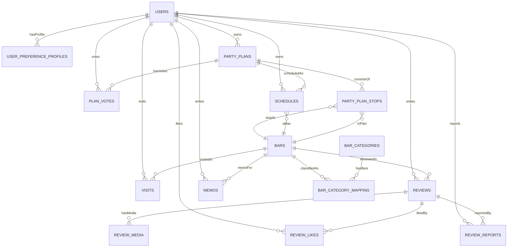
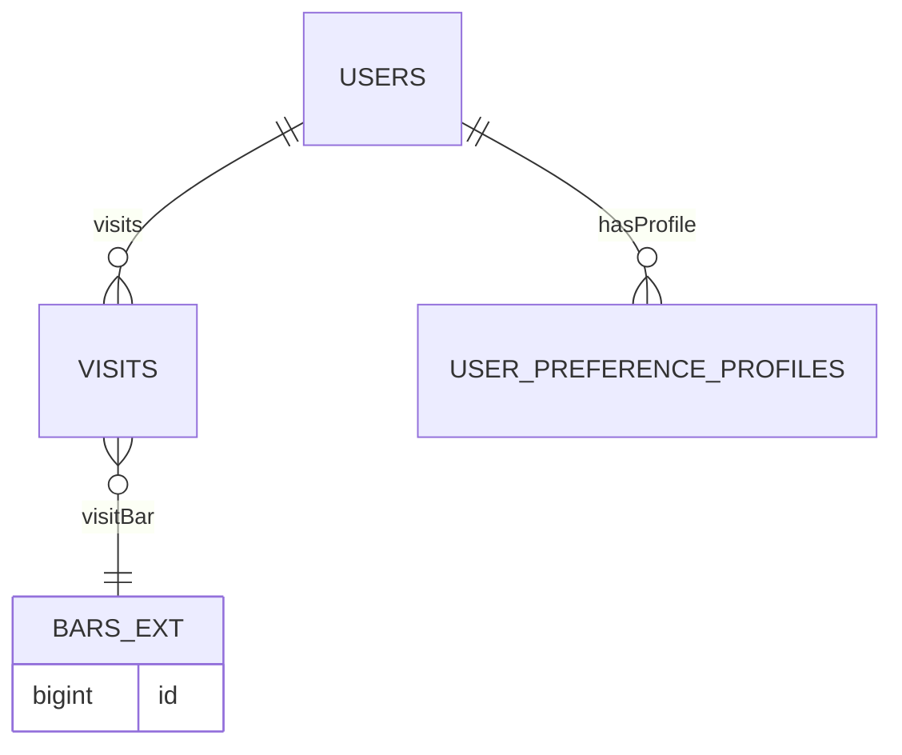
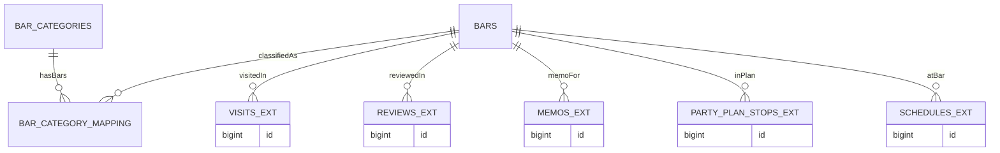
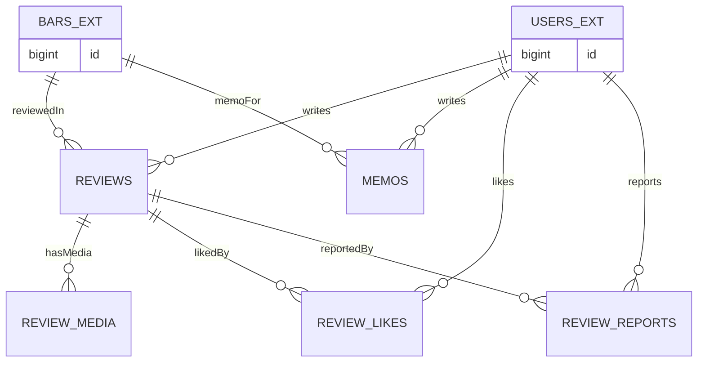
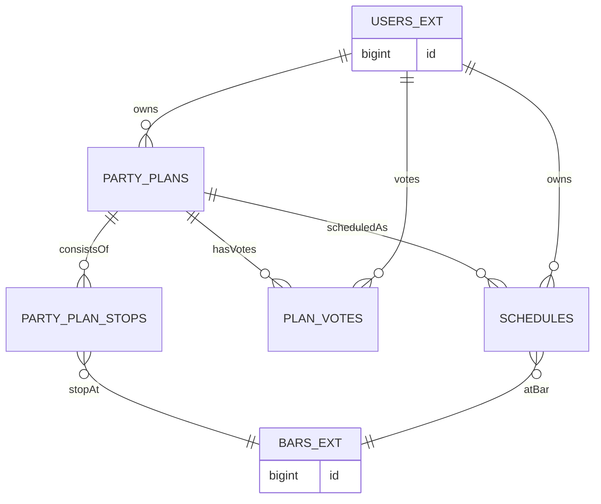

```mermaid
erDiagram
    %% === 사용자 & 방문/선호 ===
    USERS ||--o{ VISITS : visits
    USERS ||--o{ USER_PREFERENCE_PROFILES : hasProfile

    %% 리뷰/메모
    USERS ||--o{ REVIEWS : writes
    USERS ||--o{ MEMOS : writes
    USERS ||--o{ REVIEW_LIKES : likes
    USERS ||--o{ REVIEW_REPORTS : reports

    %% 플랜/일정
    USERS ||--o{ PARTY_PLANS : owns
    USERS ||--o{ PLAN_VOTES : votes
    USERS ||--o{ SCHEDULES : owns

    %% 술집/카테고리
    BARS ||--o{ VISITS : visitedIn
    BARS ||--o{ REVIEWS : reviewedIn
    BARS ||--o{ MEMOS : memoFor
    BARS ||--o{ PARTY_PLAN_STOPS : inPlan
    BARS ||--o{ BAR_CATEGORY_MAPPING : classifiedAs

    BAR_CATEGORIES ||--o{ BAR_CATEGORY_MAPPING : hasBars

    %% 리뷰 도메인
    REVIEWS ||--o{ REVIEW_MEDIA : hasMedia
    REVIEWS ||--o{ REVIEW_LIKES : likedBy
    REVIEWS ||--o{ REVIEW_REPORTS : reportedBy

    %% 플랜/코스/일정
    PARTY_PLANS ||--o{ PARTY_PLAN_STOPS : consistsOf
    PARTY_PLANS ||--o{ PLAN_VOTES : hasVotes
    PARTY_PLANS ||--o{ SCHEDULES : scheduledAs

    PARTY_PLAN_STOPS }o--|| BARS : stopAt
    SCHEDULES }o--|| BARS : atBar

```

## 1️⃣ 사용자 / 방문 / 선호 도메인 ERD

``` mermaid
erDiagram
    %% 코어 도메인 (이 섹터의 주인)
    USERS ||--o{ VISITS : visits
    USERS ||--o{ USER_PREFERENCE_PROFILES : hasProfile

    %% 외부 도메인 (참조만 함) : 실제 테이블명은 BARS
    BARS_EXT {
        bigint id
        %% 외부 엔티티: BARS
    }

    VISITS }o--|| BARS_EXT : visitBar

```

---

## 2️⃣ 술집 / 카테고리 / 지도 도메인 ERD

``` mermaid
erDiagram
    %% 코어 도메인
    BARS ||--o{ BAR_CATEGORY_MAPPING : classifiedAs
    BAR_CATEGORIES ||--o{ BAR_CATEGORY_MAPPING : hasBars

    %% 외부 도메인 (참조만 함) : 실제 테이블명은 VISITS/REVIEWS/MEMOS 등
    VISITS_EXT {
        bigint id
        %% 외부 엔티티: VISITS
    }
    REVIEWS_EXT {
        bigint id
        %% 외부 엔티티: REVIEWS
    }
    MEMOS_EXT {
        bigint id
        %% 외부 엔티티: MEMOS
    }
    PARTY_PLAN_STOPS_EXT {
        bigint id
        %% 외부 엔티티: PARTY_PLAN_STOPS
    }
    SCHEDULES_EXT {
        bigint id
        %% 외부 엔티티: SCHEDULES
    }

    %% BARS 기준의 외부 연결만 간단히 표현
    BARS ||--o{ VISITS_EXT : visitedIn
    BARS ||--o{ REVIEWS_EXT : reviewedIn
    BARS ||--o{ MEMOS_EXT : memoFor
    BARS ||--o{ PARTY_PLAN_STOPS_EXT : inPlan
    BARS ||--o{ SCHEDULES_EXT : atBar

```

---

## 3️⃣ 리뷰 / 미디어 / 좋아요 / 신고 / 개인 메모 ERD

```mermaid
erDiagram
    %% 외부 도메인 (실제 테이블명: USERS, BARS)
    USERS_EXT {
        bigint id
        %% 외부 엔티티: USERS
    }
    BARS_EXT {
        bigint id
        %% 외부 엔티티: BARS
    }

    %% 코어 도메인
    REVIEWS ||--o{ REVIEW_MEDIA : hasMedia
    REVIEWS ||--o{ REVIEW_LIKES : likedBy
    REVIEWS ||--o{ REVIEW_REPORTS : reportedBy

    %% 사용자/가게와의 관계 (외부 엔티티 연결)
    USERS_EXT ||--o{ REVIEWS : writes
    USERS_EXT ||--o{ MEMOS : writes
    USERS_EXT ||--o{ REVIEW_LIKES : likes
    USERS_EXT ||--o{ REVIEW_REPORTS : reports

    BARS_EXT ||--o{ REVIEWS : reviewedIn
    BARS_EXT ||--o{ MEMOS : memoFor

    %% 개인 메모도 이 섹터 코어로 취급
    MEMOS

```

---

## 4️⃣ 플랜(코스) / 일정 / 캘린더 뷰 ERD

```mermaid
erDiagram
    %% 외부 도메인 (실제 테이블명: USERS, BARS)
    USERS_EXT {
        bigint id
        %% 외부 엔티티: USERS
    }
    BARS_EXT {
        bigint id
        %% 외부 엔티티: BARS
    }

    %% 코어 도메인
    PARTY_PLANS ||--o{ PARTY_PLAN_STOPS : consistsOf
    PARTY_PLANS ||--o{ PLAN_VOTES : hasVotes
    PARTY_PLANS ||--o{ SCHEDULES : scheduledAs

    %% 사용자와의 관계
    USERS_EXT ||--o{ PARTY_PLANS : owns
    USERS_EXT ||--o{ PLAN_VOTES : votes
    USERS_EXT ||--o{ SCHEDULES : owns

    %% 술집과의 관계 (외부)
    PARTY_PLAN_STOPS }o--|| BARS_EXT : stopAt
    SCHEDULES }o--|| BARS_EXT : atBar

```

