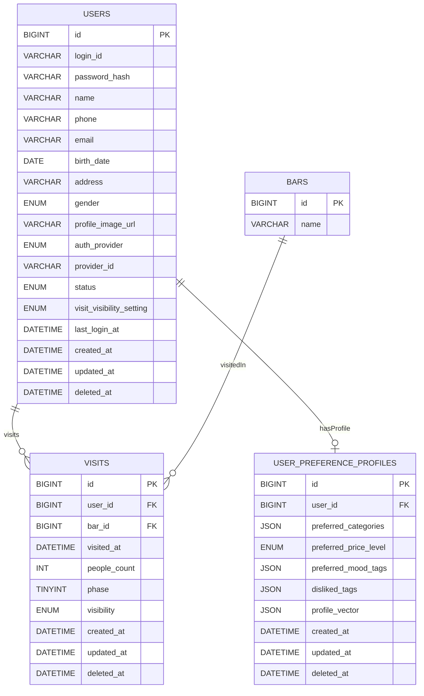
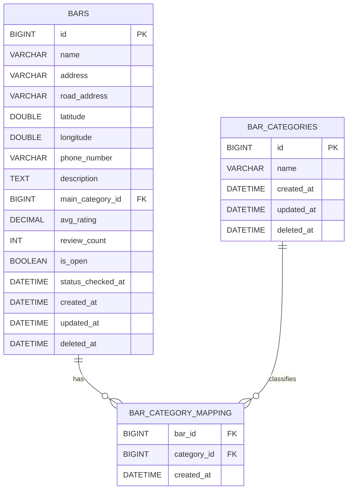
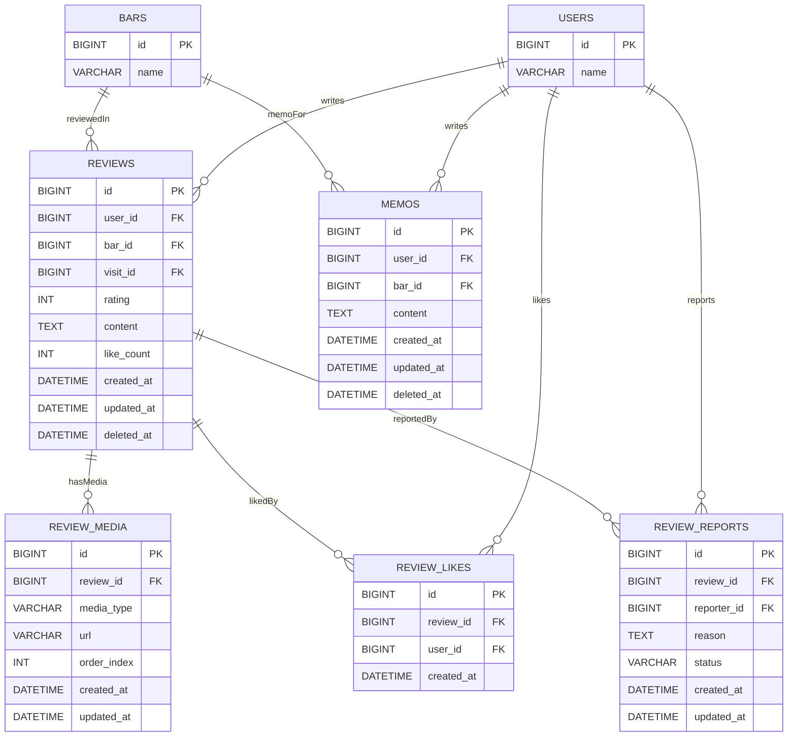
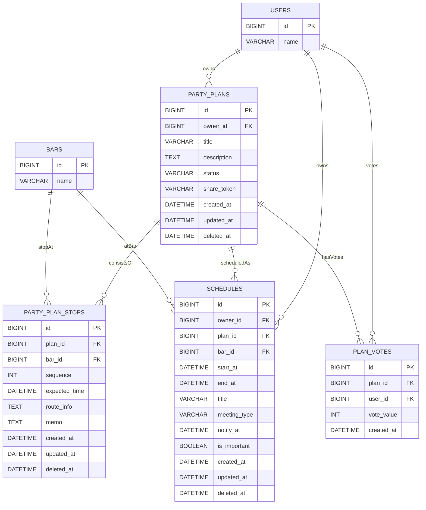

``` mermaid
erDiagram
    %% =========================
    %% 1. 사용자 / 방문 / 선호
    %% =========================
    USERS {
        BIGINT  id PK          "회원 ID"
        VARCHAR login_id       "로그인용 ID"
        VARCHAR password_hash  "비밀번호 해시"
        VARCHAR name           "이름"
        VARCHAR phone          "전화번호"
        VARCHAR email          "이메일"
        DATE    birth_date     "생년월일"
        VARCHAR address        "주소"
        VARCHAR gender         "성별 (M/F/...)"
        VARCHAR profile_image_url "프로필 이미지 URL"
        VARCHAR status         "ACTIVE/WITHDRAWN/BANNED"
        DATETIME last_login_at "마지막 로그인 시각"
        DATETIME created_at    "생성 시각"
        DATETIME updated_at    "수정 시각"
        DATETIME deleted_at    "탈퇴/삭제 시각(soft delete)"
    }

    VISITS {
        BIGINT  id PK          "방문 이력 ID"
        BIGINT  user_id FK     "방문 유저 (USERS.id)"
        BIGINT  bar_id FK      "방문 술집 (BARS.id)"
        DATETIME visited_at    "방문 시각"
        INT     people_count   "함께 간 인원 수"
        INT     phase          "1차/2차/3차 등"
        VARCHAR visibility     "PUBLIC/FRIENDS/PRIVATE"
        DATETIME created_at    "생성 시각"
        DATETIME updated_at    "수정 시각"
        DATETIME deleted_at    "삭제 시각(soft delete)"
    }

    USER_PREFERENCE_PROFILES {
        BIGINT  id PK              "선호 프로파일 ID"
        BIGINT  user_id FK         "유저 (USERS.id)"
        JSON    preferred_categories "선호 카테고리 목록"
        VARCHAR preferred_price_range "LOW/MID/HIGH 등"
        JSON    profile_json       "추천용 피처/요약 JSON"
        DATETIME created_at        "생성 시각"
        DATETIME updated_at        "수정 시각"
    }

    %% =========================
    %% 2. 술집 / 카테고리 / 지도
    %% =========================
    BARS {
        BIGINT  id PK             "술집 ID"
        VARCHAR name              "가게 이름"
        VARCHAR address           "지번 주소"
        VARCHAR road_address      "도로명 주소"
        DOUBLE  latitude          "위도"
        DOUBLE  longitude         "경도"
        VARCHAR phone_number      "전화번호"
        TEXT    description       "가게 설명"
        BIGINT  main_category_id FK "대표 카테고리 (BAR_CATEGORIES.id)"
        DECIMAL avg_rating        "평균 별점 캐시"
        INT     review_count      "리뷰 개수 캐시"
        BOOLEAN is_open           "현재 영업 중 여부"
        DATETIME status_checked_at "영업 상태 마지막 체크 시각"
        DATETIME created_at       "생성 시각"
        DATETIME updated_at       "수정 시각"
        DATETIME deleted_at       "삭제 시각(soft delete)"
    }

    BAR_CATEGORIES {
        BIGINT  id PK          "카테고리 ID"
        VARCHAR name           "카테고리명(이자카야 등)"
        DATETIME created_at    "생성 시각"
        DATETIME updated_at    "수정 시각"
        DATETIME deleted_at    "삭제 시각(soft delete)"
    }

    BAR_CATEGORY_MAPPING {
        BIGINT  bar_id FK      "술집 (BARS.id)"
        BIGINT  category_id FK "카테고리 (BAR_CATEGORIES.id)"
        DATETIME created_at    "생성 시각"
    }

    %% =========================
    %% 3. 리뷰 / 미디어 / 좋아요 / 신고 / 메모
    %% =========================
    REVIEWS {
        BIGINT  id PK          "리뷰 ID"
        BIGINT  user_id FK     "작성자 (USERS.id)"
        BIGINT  bar_id FK      "대상 술집 (BARS.id)"
        BIGINT  visit_id FK    "연결 방문이력 (VISITS.id, 옵션)"
        INT     rating         "별점 (1~5)"
        TEXT    content        "리뷰 내용"
        INT     like_count     "좋아요 수 캐시"
        DATETIME created_at    "작성 시각"
        DATETIME updated_at    "수정 시각"
        DATETIME deleted_at    "삭제 시각(soft delete)"
    }

    REVIEW_MEDIA {
        BIGINT  id PK          "미디어 ID"
        BIGINT  review_id FK   "리뷰 (REVIEWS.id)"
        VARCHAR media_type     "IMAGE/VIDEO"
        VARCHAR url            "파일 URL"
        INT     order_index    "리뷰 내 표시 순서"
        DATETIME created_at    "생성 시각"
        DATETIME updated_at    "수정 시각"
    }

    REVIEW_LIKES {
        BIGINT  id PK          "좋아요 ID"
        BIGINT  review_id FK   "리뷰 (REVIEWS.id)"
        BIGINT  user_id FK     "좋아요 유저 (USERS.id)"
        DATETIME created_at    "좋아요 시각"
    }

    REVIEW_REPORTS {
        BIGINT  id PK          "신고 ID"
        BIGINT  review_id FK   "신고 대상 리뷰 (REVIEWS.id)"
        BIGINT  reporter_id FK "신고 유저 (USERS.id)"
        TEXT    reason         "신고 사유"
        VARCHAR status         "PENDING/ACCEPTED/REJECTED 등"
        DATETIME created_at    "신고 시각"
        DATETIME updated_at    "상태 변경 시각"
    }

    MEMOS {
        BIGINT  id PK          "메모 ID"
        BIGINT  user_id FK     "메모 작성자 (USERS.id)"
        BIGINT  bar_id FK      "관련 술집 (BARS.id)"
        TEXT    content        "메모 내용"
        DATETIME created_at    "작성 시각"
        DATETIME updated_at    "수정 시각"
        DATETIME deleted_at    "삭제 시각(soft delete)"
    }

    %% =========================
    %% 4. 플랜 / 코스 / 투표 / 일정
    %% =========================
    PARTY_PLANS {
        BIGINT  id PK          "플랜 ID"
        BIGINT  owner_id FK    "플랜 생성자 (USERS.id)"
        VARCHAR title          "플랜 제목"
        TEXT    description    "플랜 설명"
        VARCHAR status         "PLANNED/DONE/CANCELLED 등"
        VARCHAR share_token    "공유용 토큰(링크)"
        DATETIME created_at    "생성 시각"
        DATETIME updated_at    "수정 시각"
        DATETIME deleted_at    "삭제 시각(soft delete)"
    }

    PARTY_PLAN_STOPS {
        BIGINT  id PK          "코스 ID"
        BIGINT  plan_id FK     "플랜 (PARTY_PLANS.id)"
        BIGINT  bar_id FK      "방문 술집 (BARS.id)"
        INT     sequence       "순서 (1=1차, 2=2차...)"
        DATETIME expected_time "예상 도착 시간"
        TEXT    route_info     "경로 정보 요약"
        TEXT    memo           "장소별 메모(예약 정보 등)"
        DATETIME created_at    "생성 시각"
        DATETIME updated_at    "수정 시각"
        DATETIME deleted_at    "삭제 시각(soft delete)"
    }

    PLAN_VOTES {
        BIGINT  id PK          "투표 ID"
        BIGINT  plan_id FK     "플랜 (PARTY_PLANS.id)"
        BIGINT  user_id FK     "투표 유저 (USERS.id)"
        INT     vote_value     "선호도 값(예: 1=좋아요)"
        DATETIME created_at    "투표 시각"
    }

    SCHEDULES {
        BIGINT  id PK          "일정 ID"
        BIGINT  owner_id FK    "일정 생성자 (USERS.id)"
        BIGINT  plan_id FK     "연결 플랜 (PARTY_PLANS.id, 옵션)"
        BIGINT  bar_id FK      "단일 장소 일정일 때 술집 (BARS.id, 옵션)"
        DATETIME start_at      "시작 시각"
        DATETIME end_at        "종료 시각"
        VARCHAR title          "캘린더 제목"
        VARCHAR meeting_type   "회식/모임/데이트 등"
        DATETIME notify_at     "알림 시각"
        BOOLEAN is_important   "중요 일정 여부"
        DATETIME created_at    "생성 시각"
        DATETIME updated_at    "수정 시각"
        DATETIME deleted_at    "삭제 시각(soft delete)"
    }

    %% =========================
    %% 관계 정의
    %% =========================
    %% 사용자 기준
    USERS ||--o{ VISITS                 : visits
    USERS ||--o{ USER_PREFERENCE_PROFILES : hasProfile
    USERS ||--o{ REVIEWS                : writes
    USERS ||--o{ MEMOS                  : writes
    USERS ||--o{ REVIEW_LIKES           : likes
    USERS ||--o{ REVIEW_REPORTS         : reports
    USERS ||--o{ PARTY_PLANS            : owns
    USERS ||--o{ PLAN_VOTES             : votes
    USERS ||--o{ SCHEDULES              : owns

    %% 술집 기준
    BARS  ||--o{ VISITS                 : visitedIn
    BARS  ||--o{ REVIEWS                : reviewedIn
    BARS  ||--o{ MEMOS                  : memoFor
    BARS  ||--o{ PARTY_PLAN_STOPS       : inPlan
    BARS  ||--o{ BAR_CATEGORY_MAPPING   : classifiedAs
    BARS  ||--o{ SCHEDULES              : atBar

    BAR_CATEGORIES ||--o{ BAR_CATEGORY_MAPPING : hasBars

    %% 리뷰 도메인
    REVIEWS ||--o{ REVIEW_MEDIA         : hasMedia
    REVIEWS ||--o{ REVIEW_LIKES         : likedBy
    REVIEWS ||--o{ REVIEW_REPORTS       : reportedBy

    %% 플랜/코스/일정
    PARTY_PLANS ||--o{ PARTY_PLAN_STOPS : consistsOf
    PARTY_PLANS ||--o{ PLAN_VOTES       : hasVotes
    PARTY_PLANS ||--o{ SCHEDULES        : scheduledAs

```

## 1. 사용자 관리 기능

``` mermaid
erDiagram
    USERS {
        BIGINT   id PK
        VARCHAR  login_id
        VARCHAR  password_hash
        VARCHAR  name
        VARCHAR  phone
        VARCHAR  email
        DATE     birth_date
        VARCHAR  address
        ENUM     gender
        VARCHAR  profile_image_url

        ENUM     auth_provider
        VARCHAR  provider_id

        ENUM     status
        ENUM     visit_visibility_setting
        DATETIME last_login_at
        DATETIME created_at
        DATETIME updated_at
        DATETIME deleted_at
    }

    USER_PREFERENCE_PROFILES {
        BIGINT   id PK
        BIGINT   user_id FK
        JSON     preferred_categories
        ENUM     preferred_price_level
        JSON     preferred_mood_tags
        JSON     disliked_tags
        JSON     profile_vector
        DATETIME created_at
        DATETIME updated_at
        DATETIME deleted_at
    }

    VISITS {
        BIGINT   id PK
        BIGINT   user_id FK
        BIGINT   bar_id FK
        DATETIME visited_at
        INT      people_count
        TINYINT  phase
        ENUM     visibility
        DATETIME created_at
        DATETIME updated_at
        DATETIME deleted_at
    }

    BARS {
        BIGINT  id PK
        VARCHAR name
    }

    USERS ||--o{ VISITS                 : visits
    USERS ||--o| USER_PREFERENCE_PROFILES : hasProfile
    BARS  ||--o{ VISITS                 : visitedIn

```

## 2. 지도 및 위치 기반 서비스

``` mermaid
erDiagram
    BARS {
        BIGINT   id PK
        VARCHAR  name
        VARCHAR  address
        VARCHAR  road_address
        DOUBLE   latitude
        DOUBLE   longitude
        VARCHAR  phone_number
        TEXT     description
        BIGINT   main_category_id FK
        DECIMAL  avg_rating
        INT      review_count
        BOOLEAN  is_open
        DATETIME status_checked_at
        DATETIME created_at
        DATETIME updated_at
        DATETIME deleted_at
    }

    BAR_CATEGORIES {
        BIGINT   id PK
        VARCHAR  name
        DATETIME created_at
        DATETIME updated_at
        DATETIME deleted_at
    }

    BAR_CATEGORY_MAPPING {
        BIGINT   bar_id FK
        BIGINT   category_id FK
        DATETIME created_at
    }

    BARS          ||--o{ BAR_CATEGORY_MAPPING   : has
    BAR_CATEGORIES ||--o{ BAR_CATEGORY_MAPPING  : classifies

```
## 3. 리뷰 및 평가 시스템

```mermaid
erDiagram
    USERS {
        BIGINT  id PK
        VARCHAR name
    }

    BARS {
        BIGINT  id PK
        VARCHAR name
    }

    REVIEWS {
        BIGINT   id PK
        BIGINT   user_id FK
        BIGINT   bar_id FK
        BIGINT   visit_id FK
        INT      rating
        TEXT     content
        INT      like_count
        DATETIME created_at
        DATETIME updated_at
        DATETIME deleted_at
    }

    REVIEW_MEDIA {
        BIGINT   id PK
        BIGINT   review_id FK
        VARCHAR  media_type
        VARCHAR  url
        INT      order_index
        DATETIME created_at
        DATETIME updated_at
    }

    REVIEW_LIKES {
        BIGINT   id PK
        BIGINT   review_id FK
        BIGINT   user_id FK
        DATETIME created_at
    }

    REVIEW_REPORTS {
        BIGINT   id PK
        BIGINT   review_id FK
        BIGINT   reporter_id FK
        TEXT     reason
        VARCHAR  status
        DATETIME created_at
        DATETIME updated_at
    }

    MEMOS {
        BIGINT   id PK
        BIGINT   user_id FK
        BIGINT   bar_id FK
        TEXT     content
        DATETIME created_at
        DATETIME updated_at
        DATETIME deleted_at
    }

    USERS ||--o{ REVIEWS        : writes
    USERS ||--o{ REVIEW_LIKES   : likes
    USERS ||--o{ REVIEW_REPORTS : reports
    USERS ||--o{ MEMOS          : writes

    BARS  ||--o{ REVIEWS        : reviewedIn
    BARS  ||--o{ MEMOS          : memoFor

    REVIEWS ||--o{ REVIEW_MEDIA   : hasMedia
    REVIEWS ||--o{ REVIEW_LIKES   : likedBy
    REVIEWS ||--o{ REVIEW_REPORTS : reportedBy

```

## 4. 플랜 및 일정 관리

``` mermaid
erDiagram
    USERS {
        BIGINT  id PK
        VARCHAR name
    }

    BARS {
        BIGINT  id PK
        VARCHAR name
    }

    PARTY_PLANS {
        BIGINT   id PK
        BIGINT   owner_id FK
        VARCHAR  title
        TEXT     description
        VARCHAR  status
        VARCHAR  share_token
        DATETIME created_at
        DATETIME updated_at
        DATETIME deleted_at
    }

    PARTY_PLAN_STOPS {
        BIGINT   id PK
        BIGINT   plan_id FK
        BIGINT   bar_id FK
        INT      sequence
        DATETIME expected_time
        TEXT     route_info
        TEXT     memo
        DATETIME created_at
        DATETIME updated_at
        DATETIME deleted_at
    }

    PLAN_VOTES {
        BIGINT   id PK
        BIGINT   plan_id FK
        BIGINT   user_id FK
        INT      vote_value
        DATETIME created_at
    }

    SCHEDULES {
        BIGINT   id PK
        BIGINT   owner_id FK
        BIGINT   plan_id FK
        BIGINT   bar_id FK
        DATETIME start_at
        DATETIME end_at
        VARCHAR  title
        VARCHAR  meeting_type
        DATETIME notify_at
        BOOLEAN  is_important
        DATETIME created_at
        DATETIME updated_at
        DATETIME deleted_at
    }

    USERS ||--o{ PARTY_PLANS : owns
    USERS ||--o{ PLAN_VOTES  : votes
    USERS ||--o{ SCHEDULES   : owns

    PARTY_PLANS ||--o{ PARTY_PLAN_STOPS : consistsOf
    PARTY_PLANS ||--o{ PLAN_VOTES       : hasVotes
    PARTY_PLANS ||--o{ SCHEDULES        : scheduledAs

    BARS ||--o{ PARTY_PLAN_STOPS        : stopAt
    BARS ||--o{ SCHEDULES               : atBar

```
