``` mermaid
erDiagram
    %% =========================
    %% 1. 사용자 / 방문 / 선호
    %% =========================
    USERS {
        BIGINT  id PK          "회원 ID"
        VARCHAR login_id       "로그인용 ID"
        VARCHAR password_hash  "비밀번호 해시"
        VARCHAR name           "이름"
        VARCHAR phone          "전화번호"
        VARCHAR email          "이메일"
        DATE    birth_date     "생년월일"
        VARCHAR address        "주소"
        VARCHAR gender         "성별 (M/F/...)"
        VARCHAR profile_image_url "프로필 이미지 URL"
        VARCHAR status         "ACTIVE/WITHDRAWN/BANNED"
        DATETIME last_login_at "마지막 로그인 시각"
        DATETIME created_at    "생성 시각"
        DATETIME updated_at    "수정 시각"
        DATETIME deleted_at    "탈퇴/삭제 시각(soft delete)"
    }

    VISITS {
        BIGINT  id PK          "방문 이력 ID"
        BIGINT  user_id FK     "방문 유저 (USERS.id)"
        BIGINT  bar_id FK      "방문 술집 (BARS.id)"
        DATETIME visited_at    "방문 시각"
        INT     people_count   "함께 간 인원 수"
        INT     phase          "1차/2차/3차 등"
        VARCHAR visibility     "PUBLIC/FRIENDS/PRIVATE"
        DATETIME created_at    "생성 시각"
        DATETIME updated_at    "수정 시각"
        DATETIME deleted_at    "삭제 시각(soft delete)"
    }

    USER_PREFERENCE_PROFILES {
        BIGINT  id PK              "선호 프로파일 ID"
        BIGINT  user_id FK         "유저 (USERS.id)"
        JSON    preferred_categories "선호 카테고리 목록"
        VARCHAR preferred_price_range "LOW/MID/HIGH 등"
        JSON    profile_json       "추천용 피처/요약 JSON"
        DATETIME created_at        "생성 시각"
        DATETIME updated_at        "수정 시각"
    }

    %% =========================
    %% 2. 술집 / 카테고리 / 지도
    %% =========================
    BARS {
        BIGINT  id PK             "술집 ID"
        VARCHAR name              "가게 이름"
        VARCHAR address           "지번 주소"
        VARCHAR road_address      "도로명 주소"
        DOUBLE  latitude          "위도"
        DOUBLE  longitude         "경도"
        VARCHAR phone_number      "전화번호"
        TEXT    description       "가게 설명"
        BIGINT  main_category_id FK "대표 카테고리 (BAR_CATEGORIES.id)"
        DECIMAL avg_rating        "평균 별점 캐시"
        INT     review_count      "리뷰 개수 캐시"
        BOOLEAN is_open           "현재 영업 중 여부"
        DATETIME status_checked_at "영업 상태 마지막 체크 시각"
        DATETIME created_at       "생성 시각"
        DATETIME updated_at       "수정 시각"
        DATETIME deleted_at       "삭제 시각(soft delete)"
    }

    BAR_CATEGORIES {
        BIGINT  id PK          "카테고리 ID"
        VARCHAR name           "카테고리명(이자카야 등)"
        DATETIME created_at    "생성 시각"
        DATETIME updated_at    "수정 시각"
        DATETIME deleted_at    "삭제 시각(soft delete)"
    }

    BAR_CATEGORY_MAPPING {
        BIGINT  bar_id FK      "술집 (BARS.id)"
        BIGINT  category_id FK "카테고리 (BAR_CATEGORIES.id)"
        DATETIME created_at    "생성 시각"
    }

    %% =========================
    %% 3. 리뷰 / 미디어 / 좋아요 / 신고 / 메모
    %% =========================
    REVIEWS {
        BIGINT  id PK          "리뷰 ID"
        BIGINT  user_id FK     "작성자 (USERS.id)"
        BIGINT  bar_id FK      "대상 술집 (BARS.id)"
        BIGINT  visit_id FK    "연결 방문이력 (VISITS.id, 옵션)"
        INT     rating         "별점 (1~5)"
        TEXT    content        "리뷰 내용"
        INT     like_count     "좋아요 수 캐시"
        DATETIME created_at    "작성 시각"
        DATETIME updated_at    "수정 시각"
        DATETIME deleted_at    "삭제 시각(soft delete)"
    }

    REVIEW_MEDIA {
        BIGINT  id PK          "미디어 ID"
        BIGINT  review_id FK   "리뷰 (REVIEWS.id)"
        VARCHAR media_type     "IMAGE/VIDEO"
        VARCHAR url            "파일 URL"
        INT     order_index    "리뷰 내 표시 순서"
        DATETIME created_at    "생성 시각"
        DATETIME updated_at    "수정 시각"
    }

    REVIEW_LIKES {
        BIGINT  id PK          "좋아요 ID"
        BIGINT  review_id FK   "리뷰 (REVIEWS.id)"
        BIGINT  user_id FK     "좋아요 유저 (USERS.id)"
        DATETIME created_at    "좋아요 시각"
    }

    REVIEW_REPORTS {
        BIGINT  id PK          "신고 ID"
        BIGINT  review_id FK   "신고 대상 리뷰 (REVIEWS.id)"
        BIGINT  reporter_id FK "신고 유저 (USERS.id)"
        TEXT    reason         "신고 사유"
        VARCHAR status         "PENDING/ACCEPTED/REJECTED 등"
        DATETIME created_at    "신고 시각"
        DATETIME updated_at    "상태 변경 시각"
    }

    MEMOS {
        BIGINT  id PK          "메모 ID"
        BIGINT  user_id FK     "메모 작성자 (USERS.id)"
        BIGINT  bar_id FK      "관련 술집 (BARS.id)"
        TEXT    content        "메모 내용"
        DATETIME created_at    "작성 시각"
        DATETIME updated_at    "수정 시각"
        DATETIME deleted_at    "삭제 시각(soft delete)"
    }

    %% =========================
    %% 4. 플랜 / 코스 / 투표 / 일정
    %% =========================
    PARTY_PLANS {
        BIGINT  id PK          "플랜 ID"
        BIGINT  owner_id FK    "플랜 생성자 (USERS.id)"
        VARCHAR title          "플랜 제목"
        TEXT    description    "플랜 설명"
        VARCHAR status         "PLANNED/DONE/CANCELLED 등"
        VARCHAR share_token    "공유용 토큰(링크)"
        DATETIME created_at    "생성 시각"
        DATETIME updated_at    "수정 시각"
        DATETIME deleted_at    "삭제 시각(soft delete)"
    }

    PARTY_PLAN_STOPS {
        BIGINT  id PK          "코스 ID"
        BIGINT  plan_id FK     "플랜 (PARTY_PLANS.id)"
        BIGINT  bar_id FK      "방문 술집 (BARS.id)"
        INT     sequence       "순서 (1=1차, 2=2차...)"
        DATETIME expected_time "예상 도착 시간"
        TEXT    route_info     "경로 정보 요약"
        TEXT    memo           "장소별 메모(예약 정보 등)"
        DATETIME created_at    "생성 시각"
        DATETIME updated_at    "수정 시각"
        DATETIME deleted_at    "삭제 시각(soft delete)"
    }

    PLAN_VOTES {
        BIGINT  id PK          "투표 ID"
        BIGINT  plan_id FK     "플랜 (PARTY_PLANS.id)"
        BIGINT  user_id FK     "투표 유저 (USERS.id)"
        INT     vote_value     "선호도 값(예: 1=좋아요)"
        DATETIME created_at    "투표 시각"
    }

    SCHEDULES {
        BIGINT  id PK          "일정 ID"
        BIGINT  owner_id FK    "일정 생성자 (USERS.id)"
        BIGINT  plan_id FK     "연결 플랜 (PARTY_PLANS.id, 옵션)"
        BIGINT  bar_id FK      "단일 장소 일정일 때 술집 (BARS.id, 옵션)"
        DATETIME start_at      "시작 시각"
        DATETIME end_at        "종료 시각"
        VARCHAR title          "캘린더 제목"
        VARCHAR meeting_type   "회식/모임/데이트 등"
        DATETIME notify_at     "알림 시각"
        BOOLEAN is_important   "중요 일정 여부"
        DATETIME created_at    "생성 시각"
        DATETIME updated_at    "수정 시각"
        DATETIME deleted_at    "삭제 시각(soft delete)"
    }

    %% =========================
    %% 관계 정의
    %% =========================
    %% 사용자 기준
    USERS ||--o{ VISITS                 : visits
    USERS ||--o{ USER_PREFERENCE_PROFILES : hasProfile
    USERS ||--o{ REVIEWS                : writes
    USERS ||--o{ MEMOS                  : writes
    USERS ||--o{ REVIEW_LIKES           : likes
    USERS ||--o{ REVIEW_REPORTS         : reports
    USERS ||--o{ PARTY_PLANS            : owns
    USERS ||--o{ PLAN_VOTES             : votes
    USERS ||--o{ SCHEDULES              : owns

    %% 술집 기준
    BARS  ||--o{ VISITS                 : visitedIn
    BARS  ||--o{ REVIEWS                : reviewedIn
    BARS  ||--o{ MEMOS                  : memoFor
    BARS  ||--o{ PARTY_PLAN_STOPS       : inPlan
    BARS  ||--o{ BAR_CATEGORY_MAPPING   : classifiedAs
    BARS  ||--o{ SCHEDULES              : atBar

    BAR_CATEGORIES ||--o{ BAR_CATEGORY_MAPPING : hasBars

    %% 리뷰 도메인
    REVIEWS ||--o{ REVIEW_MEDIA         : hasMedia
    REVIEWS ||--o{ REVIEW_LIKES         : likedBy
    REVIEWS ||--o{ REVIEW_REPORTS       : reportedBy

    %% 플랜/코스/일정
    PARTY_PLANS ||--o{ PARTY_PLAN_STOPS : consistsOf
    PARTY_PLANS ||--o{ PLAN_VOTES       : hasVotes
    PARTY_PLANS ||--o{ SCHEDULES        : scheduledAs

```

## 1. 사용자 관리 기능

## 2. 지도 및 위치 기반 서비스

## 3. 리뷰 및 평가 시스템

## 4. 플랜 및 일정 관리

## 0. 공통 컬럼 베이스

| 컬럼명          | 타입        | NOT NULL | 설명                      |
| ------------ | --------- | -------- | ----------------------- |
| `id`         | BIGINT PK | Y        | 기본 키                    |
| `created_at` | DATETIME  | Y        | 생성 시각                   |
| `updated_at` | DATETIME  | Y        | 마지막 수정 시각               |
| `deleted_at` | DATETIME  | N        | 삭제(비활성) 시각, soft delete |

---

## 1. 사용자 관리 기능

### 1-1. USERS (회원)

FR: 회원가입, 로그인, 프로필 수정, 탈퇴, 방문 이력 공개 범위 설정 (FR1, FR2, FR6, FR7, FR19 등)

| 컬럼명                 | 타입           | NOT NULL  | 설명                            |
| ------------------- | ------------ | --------- | ----------------------------- |
| `id`                | BIGINT PK    | Y         | 회원 ID                         |
| `login_id`          | VARCHAR(50)  | Y, UNIQUE | 로그인용 아이디                      |
| `password_hash`     | VARCHAR(255) | Y         | 비밀번호 해시                       |
| `name`              | VARCHAR(50)  | Y         | 이름                            |
| `phone`             | VARCHAR(20)  | N         | 전화번호                          |
| `email`             | VARCHAR(100) | N         | 이메일                           |
| `birth_date`        | DATE         | N         | 생년월일                          |
| `address`           | VARCHAR(255) | N         | 주소                            |
| `gender`            | VARCHAR(10)  | N         | 성별                            |
| `profile_image_url` | VARCHAR(255) | N         | 프로필 이미지                       |
| `status`            | VARCHAR(20)  | Y         | ACTIVE / WITHDRAWN / BANNED 등 |
| `last_login_at`     | DATETIME     | N         | 마지막 로그인 시각                    |
| `created_at`        | DATETIME     | Y         |                               |
| `updated_at`        | DATETIME     | Y         |                               |
| `deleted_at`        | DATETIME     | N         | 탈퇴 시각 (status와 함께 사용)         |

> 탈퇴 시에는 status를 WITHDRAWN으로 바꾸고,  
> 리뷰/방문 기록은 user_id는 유지하되, 화면 표시는 익명 처리하면 됨.

---

### 1-2. VISITS (방문 이력)

FR: 방문 술집, 방문 일시, 인원수 기록 + 공개 범위 설정 (FR14, FR19)

|컬럼명|타입|NOT NULL|설명|
|---|---|---|---|
|`id`|BIGINT PK|Y|방문 이력 ID|
|`user_id`|BIGINT FK|Y|방문한 유저 (USERS.id)|
|`bar_id`|BIGINT FK|Y|방문한 술집 (BARS.id)|
|`visited_at`|DATETIME|Y|방문 시각|
|`people_count`|INT|N|함께 간 인원 수|
|`phase`|INT|N|1차/2차/3차… (1,2,3…)|
|`visibility`|VARCHAR(20)|Y|PUBLIC / FRIENDS / PRIVATE (공개 범위)|
|`created_at`|DATETIME|Y||
|`updated_at`|DATETIME|Y||
|`deleted_at`|DATETIME|N||

> **FR19**의 “술자리 이력 공개 범위”는
> 
> - 간단하게는 `VISITS.visibility` 를 일괄 변경하는 식으로 구현 가능.
>     
> - 나중에 진짜 친구 기능 붙이면 FRIENDS_ONLY도 의미 생김.
>     

---

### 1-3. USER_PREFERENCE_PROFILES (선호도 프로파일)

FR: 방문 이력 + 리뷰 데이터를 기반으로 선호 술/분위기/가격대 프로파일링 (FR10, FR11, FR16)

|컬럼명|타입|NOT NULL|설명|
|---|---|---|---|
|`id`|BIGINT PK|Y|프로파일 ID|
|`user_id`|BIGINT FK|Y|대상 유저 (USERS.id)|
|`preferred_categories`|JSON/TEXT|N|선호 카테고리 목록 (이자카야, 와인바 등)|
|`preferred_price_range`|VARCHAR(20)|N|LOW / MID / HIGH 등|
|`profile_json`|JSON/TEXT|N|추천에 쓰는 피처 묶음, 자유 형식 JSON|
|`created_at`|DATETIME|Y||
|`updated_at`|DATETIME|Y||

> 추천 모델을 어떻게 짜든, 결과를 캐시할 그릇 정도로 두면 됨.

---

## 2. 지도 및 위치 기반 서비스

### 2-1. BARS (술집)

FR: 지도에서 주변 술집 조회, 추천 후보, 리뷰 대상, “영업 중/종료” 표시 (지도/추천/리뷰 FR 전반)

|컬럼명|타입|NOT NULL|설명|
|---|---|---|---|
|`id`|BIGINT PK|Y|술집 ID|
|`name`|VARCHAR(100)|Y|가게 이름|
|`address`|VARCHAR(255)|Y|지번 주소|
|`road_address`|VARCHAR(255)|N|도로명 주소|
|`latitude`|DOUBLE|Y|위도|
|`longitude`|DOUBLE|Y|경도|
|`phone_number`|VARCHAR(30)|N|전화번호|
|`description`|TEXT|N|가게 설명|
|`main_category_id`|BIGINT FK|N|대표 카테고리 (BAR_CATEGORIES.id)|
|`avg_rating`|DECIMAL(2,1)|N|평균 별점 캐시|
|`review_count`|INT|N|리뷰 개수 캐시|
|`is_open`|BOOLEAN|N|현재 영업 중 여부 (캐시)|
|`status_checked_at`|DATETIME|N|영업 상태 마지막 체크 시각|
|`created_at`|DATETIME|Y||
|`updated_at`|DATETIME|Y||
|`deleted_at`|DATETIME|N||

> Kakao/Naver API의 `open_now` 같은 정보를 주기적으로 업데이트하면 FR12(영업중/종료 표시) 대응 가능.

---

### 2-2. BAR_CATEGORIES

| 컬럼명          | 타입          | NOT NULL | 설명            |
| ------------ | ----------- | -------- | ------------- |
| `id`         | BIGINT PK   | Y        | 카테고리 ID       |
| `name`       | VARCHAR(50) | Y        | 카테고리명(이자카야 등) |
| `created_at` | DATETIME    | Y        |               |
| `updated_at` | DATETIME    | Y        |               |
| `deleted_at` | DATETIME    | N        |               |

---

### 2-3. BAR_CATEGORY_MAPPING (다대다 매핑)

| 컬럼명           | 타입        | NOT NULL | 설명                       |
| ------------- | --------- | -------- | ------------------------ |
| `bar_id`      | BIGINT FK | Y        | 술집 (BARS.id)             |
| `category_id` | BIGINT FK | Y        | 카테고리 (BAR_CATEGORIES.id) |
| `created_at`  | DATETIME  | Y        |                          |

> PK는 `(bar_id, category_id)` 복합키 추천.

---

## 3. 리뷰 및 평가 시스템

### 3-1. REVIEWS

FR: 리뷰 개수, 별점 평균/분포, 정렬, 상세 보기, 작성/수정/삭제, 내 리뷰 모아보기 등 전체 리뷰 요구사항(MVP) 대응

| 컬럼명          | 타입        | NOT NULL | 설명                         |
| ------------ | --------- | -------- | -------------------------- |
| `id`         | BIGINT PK | Y        | 리뷰 ID                      |
| `user_id`    | BIGINT FK | Y        | 작성자 (USERS.id)             |
| `bar_id`     | BIGINT FK | Y        | 대상 술집 (BARS.id)            |
| `visit_id`   | BIGINT FK | N        | 연결된 방문 기록 (VISITS.id, 있으면) |
| `rating`     | INT       | Y        | 별점 (1~5)                   |
| `content`    | TEXT      | Y        | 리뷰 텍스트                     |
| `like_count` | INT       | N        | 좋아요 수 캐시                   |
| `created_at` | DATETIME  | Y        | 작성 시각                      |
| `updated_at` | DATETIME  | Y        | 수정 시각                      |
| `deleted_at` | DATETIME  | N        | 삭제 시각                      |

---

### 3-2. REVIEW_MEDIA (리뷰 사진/영상)

| 컬럼명           | 타입           | NOT NULL | 설명              |
| ------------- | ------------ | -------- | --------------- |
| `id`          | BIGINT PK    | Y        | 미디어 ID          |
| `review_id`   | BIGINT FK    | Y        | 리뷰 (REVIEWS.id) |
| `media_type`  | VARCHAR(10)  | Y        | IMAGE / VIDEO   |
| `url`         | VARCHAR(255) | Y        | 파일 URL          |
| `order_index` | INT          | N        | 한 리뷰 내에서의 표시 순서 |
| `created_at`  | DATETIME     | Y        |                 |
| `updated_at`  | DATETIME     | Y        |                 |

---

### 3-3. REVIEW_LIKES (리뷰 좋아요)

FR: 리뷰 추천(좋아요) / 취소, 추천수 표시 (FR19, FR20 in 리뷰 시스템)

|컬럼명|타입|NOT NULL|설명|
|---|---|---|---|
|`id`|BIGINT PK|Y|내부 ID (혹은 생략하고 복합PK도 가능)|
|`review_id`|BIGINT FK|Y|대상 리뷰 (REVIEWS.id)|
|`user_id`|BIGINT FK|Y|좋아요한 유저 (USERS.id)|
|`created_at`|DATETIME|Y|좋아요 누른 시각|

> `(review_id, user_id)` UNIQUE로 걸어서 중복 좋아요 방지.

---

### 3-4. REVIEW_REPORTS (리뷰 신고)

FR: 리뷰 신고 (FR32)

| 컬럼명           | 타입          | NOT NULL | 설명                              |
| ------------- | ----------- | -------- | ------------------------------- |
| `id`          | BIGINT PK   | Y        | 신고 ID                           |
| `review_id`   | BIGINT FK   | Y        | 신고 대상 리뷰 (REVIEWS.id)           |
| `reporter_id` | BIGINT FK   | Y        | 신고한 유저 (USERS.id)               |
| `reason`      | TEXT        | Y        | 신고 사유                           |
| `status`      | VARCHAR(20) | Y        | PENDING / ACCEPTED / REJECTED 등 |
| `created_at`  | DATETIME    | Y        | 신고 시각                           |
| `updated_at`  | DATETIME    | Y        | 상태 변경 시각                        |

---

### 3-5. MEMOS (개인 메모)

FR: 나만 보는 메모 (FR35)

| 컬럼명          | 타입        | NOT NULL | 설명                |
| ------------ | --------- | -------- | ----------------- |
| `id`         | BIGINT PK | Y        | 메모 ID             |
| `user_id`    | BIGINT FK | Y        | 메모 작성자 (USERS.id) |
| `bar_id`     | BIGINT FK | Y        | 관련 술집 (BARS.id)   |
| `content`    | TEXT      | Y        | 메모 내용             |
| `created_at` | DATETIME  | Y        |                   |
| `updated_at` | DATETIME  | Y        |                   |
| `deleted_at` | DATETIME  | N        |                   |

---

## 4. AI 추천 서비스

별도 테이블이 아니라, **이미 있는 것들을 AI가 사용하는 구조**:

- **환경/상황 입력 (FR1, FR5)** ➜ 요청 payload로 들어오고, DB에는 안 남겨도 됨.
    
- **후보 생성 (FR7~FR11)** ➜
    
    - 후보: `BARS` + `BAR_CATEGORY_MAPPING`
        
    - 근처: `BARS.latitude/longitude` + 현재 위치
        
    - 이력/선호: `VISITS`, `REVIEWS`, `USER_PREFERENCE_PROFILES`
        
- **영업중/리뷰수/평점 (FR12, FR13)** ➜ `BARS.is_open`, `BARS.avg_rating`, `BARS.review_count`
    

추가로 “추천 로그”를 DB에 남기고 싶으면, 나중에 `RECOMMENDATION_HISTORY` 같은 테이블을 **옵션**으로 다시 붙이면 됨 (지금은 코어에서 제외).

---

## 5. 플랜 및 일정 관리 서비스

### 5-1. PARTY_PLANS (술자리 플랜)

FR: 1/2/3차 코스 플랜 생성/수정/삭제/공유/투표 (FR1, FR3, FR4 in 플랜)

| 컬럼명           | 타입           | NOT NULL | 설명                           |
| ------------- | ------------ | -------- | ---------------------------- |
| `id`          | BIGINT PK    | Y        | 플랜 ID                        |
| `owner_id`    | BIGINT FK    | Y        | 플랜 생성자 (USERS.id)            |
| `title`       | VARCHAR(100) | Y        | 플랜 이름                        |
| `description` | TEXT         | N        | 플랜 설명                        |
| `status`      | VARCHAR(20)  | Y        | PLANNED / DONE / CANCELLED 등 |
| `share_token` | VARCHAR(64)  | N/UNIQUE | 공유용 토큰(링크로 접근할 때 사용)         |
| `created_at`  | DATETIME     | Y        |                              |
| `updated_at`  | DATETIME     | Y        |                              |
| `deleted_at`  | DATETIME     | N        |                              |

> **소셜(그룹/채널/채팅)** 없이도,  
> `share_token`으로 “링크 공유 + 로그인한 친구가 투표” 시나리오 가능.

---

### 5-2. PARTY_PLAN_STOPS (플랜 내 코스/장소)

FR: 1차/2차/3차 순서대로 코스 구성 (FR1)

| 컬럼명             | 타입        | NOT NULL | 설명                      |
| --------------- | --------- | -------- | ----------------------- |
| `id`            | BIGINT PK | Y        | 코스 ID                   |
| `plan_id`       | BIGINT FK | Y        | 플랜 (PARTY_PLANS.id)     |
| `bar_id`        | BIGINT FK | Y        | 들를 술집 (BARS.id)         |
| `sequence`      | INT       | Y        | 순서 (1=1차, 2=2차…)        |
| `expected_time` | DATETIME  | N        | 예상 도착 시간 (2차 기능에서 써도 됨) |
| `route_info`    | TEXT/JSON | N        | 경로 정보 요약                |
| `memo`          | TEXT      | N        | 해당 장소 메모(예약 정보 등)       |
| `created_at`    | DATETIME  | Y        |                         |
| `updated_at`    | DATETIME  | Y        |                         |
| `deleted_at`    | DATETIME  | N        |                         |

> FR2(예상 도착 시간, 이동 경로)는 현재는 MUST가 아니라서  
> `expected_time`, `route_info`는 **nullable**로만 깔고 두면 됨.

---

### 5-3. PLAN_VOTES (플랜 투표)

FR: 공유된 플랜에 대해 친구들이 선호 표시 (FR3)

|컬럼명|타입|NOT NULL|설명|
|---|---|---|---|
|`id`|BIGINT PK|Y|투표 ID|
|`plan_id`|BIGINT FK|Y|플랜 (PARTY_PLANS.id)|
|`user_id`|BIGINT FK|Y|투표한 유저 (USERS.id)|
|`vote_value`|INT|Y|선호도 값 (예: 1=좋아요 / 0=보통 등)|
|`created_at`|DATETIME|Y|투표 시각|

> `(plan_id, user_id)` UNIQUE로 걸어서 한 유저당 한 번만 투표하도록 할 수 있음.

---

### 5-4. SCHEDULES (술자리 일정)

FR: 일정 등록/알림/이력 조회 (FR10, FR11, FR13, FR14, FR16, FR17)

| 컬럼명            | 타입           | NOT NULL | 설명                              |
| -------------- | ------------ | -------- | ------------------------------- |
| `id`           | BIGINT PK    | Y        | 일정 ID                           |
| `owner_id`     | BIGINT FK    | Y        | 일정 생성자 (USERS.id)               |
| `plan_id`      | BIGINT FK    | N        | 연결된 플랜 (PARTY_PLANS.id)         |
| `bar_id`       | BIGINT FK    | N        | 단일 장소 일정일 때 술집 (BARS.id)        |
| `start_at`     | DATETIME     | Y        | 시작 시각                           |
| `end_at`       | DATETIME     | N        | 종료 시각                           |
| `title`        | VARCHAR(100) | Y        | 캘린더에 보일 제목 (“19:00 강남 1차 회식” 등) |
| `meeting_type` | VARCHAR(20)  | N        | 회식/친구모임/데이트 등 아이콘 분류            |
| `notify_at`    | DATETIME     | N        | 알림 시각 (MVP에선 1개만, 복수 알림은 2차 기능) |
| `is_important` | BOOLEAN      | N        | 중요 일정 여부 (색상/배지 강조용)            |
| `created_at`   | DATETIME     | Y        |                                 |
| `updated_at`   | DATETIME     | Y        |                                 |
| `deleted_at`   | DATETIME     | N        |                                 |
